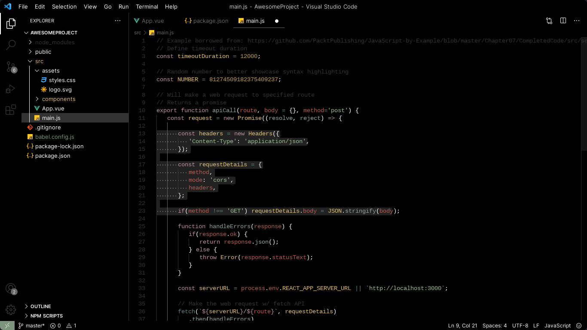

# Kultist color theme


A black and minimal color theme for VS Code with a subtle [Gruvbox](https://github.com/morhetz/gruvbox) inspired palette.



For a better integration, in your user settings (`settings.json`) add the following:

```json
// Allow the title bar to be styled by the color theme
"window.titleBarStyle": "custom"
```
