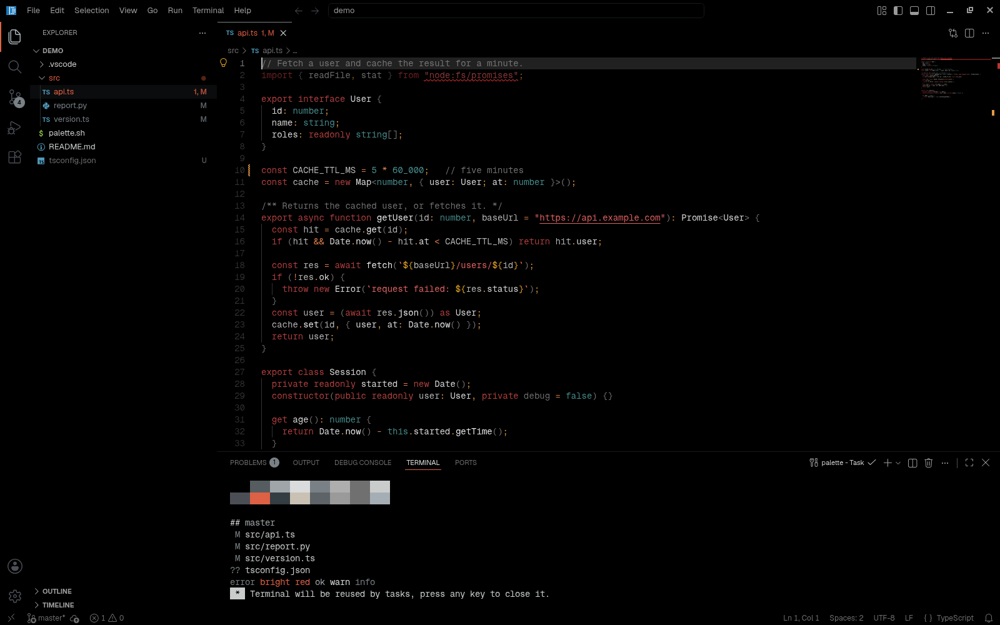
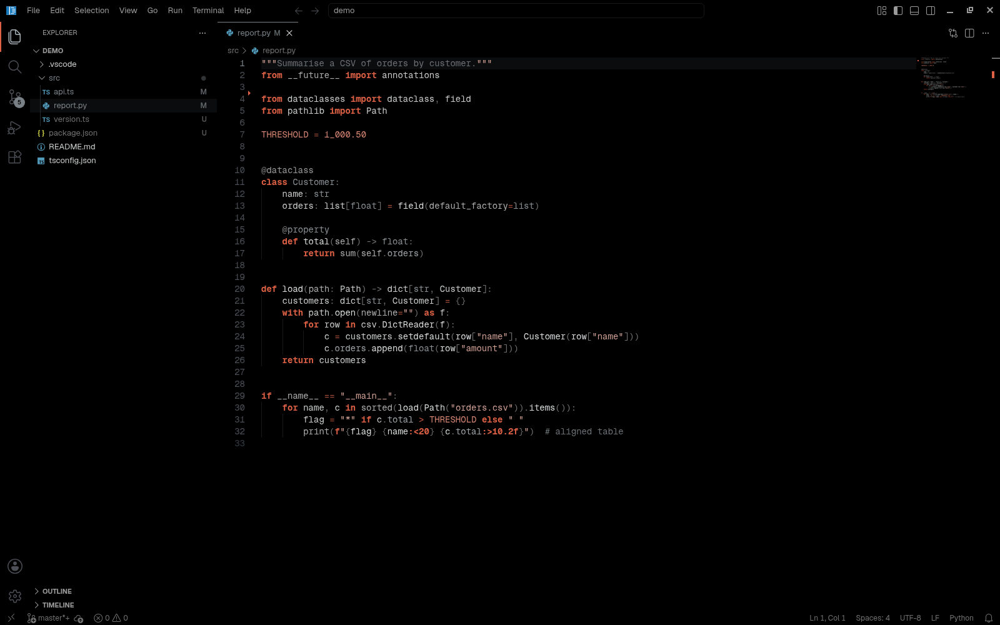
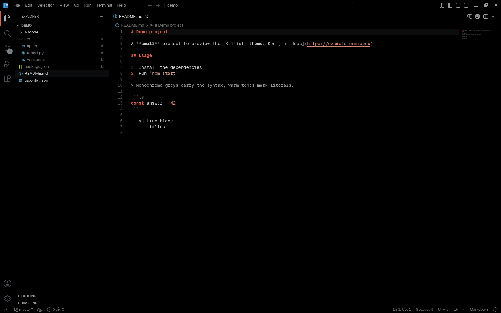
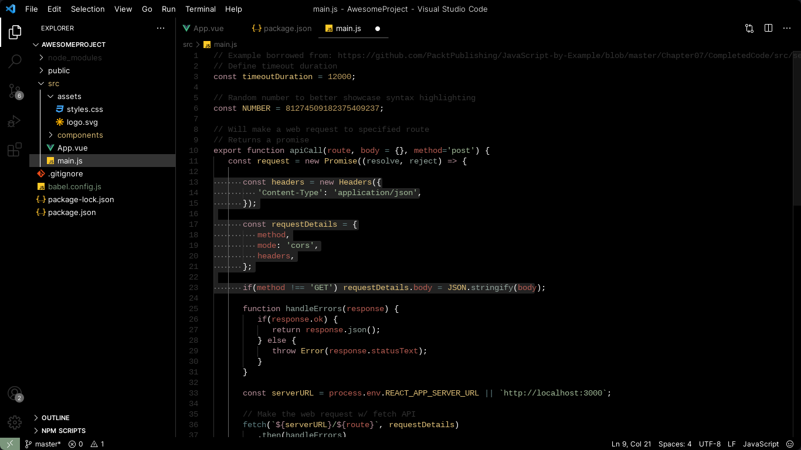

# Kultist color theme

A black and minimal color theme. Monochrome greys carry the structure of the code, and
shades of a single red accent mark what matters: keywords, literals and operators. No
italics, no coloured surfaces, just true black.







## Install

**VS Code**: install from the
[Visual Studio Marketplace](https://marketplace.visualstudio.com/items?itemName=codekult.kultist-color-theme),
or run:

```sh
code --install-extension codekult.kultist-color-theme
```

**VSCodium, Code - OSS, Cursor and other editors that use Open VSX**: install from
[Open VSX](https://open-vsx.org/extension/codekult/kultist-color-theme), or run (with your
editor's CLI, e.g. `codium`, `code-oss`, `cursor`):

```sh
codium --install-extension codekult.kultist-color-theme
```

Then open **Preferences: Color Theme** (`Ctrl+K Ctrl+T`, `Cmd+K Cmd+T` on macOS) and pick
**Kultist**.

## Kultist Classic

Version 2.0 replaced the look of **Kultist**. The original theme (white text on black, with
a subtle [Gruvbox](https://github.com/morhetz/gruvbox) inspired palette) is still included,
unchanged, as **Kultist Classic**. To keep using it, pick it in the theme picker, or set:

```json
"workbench.colorTheme": "Kultist Classic"
```



## Palette

| Role | Colour |
| --- | --- |
| Background | `#000000` |
| Text, variables | `#cacccc` |
| Functions | `#d9dbdc` |
| Parameters, builtins | `#aeaeae` |
| Properties, modules | `#9fa5a9` |
| Types | `#8a9094` |
| Comments | `#6b7175` |
| Punctuation | `#707070` |
| Slate accent (active tab, badges, git changes) | `#798186` |
| Keywords (bold), accent, errors | `#de6145` |
| Operators | `#c0573f` |
| Numbers, constants | `#d78674` |
| Strings | `#d2a196` |

The integrated terminal uses the same 16 ANSI colours as the Kultist terminal palette.

## Recommended settings

Let the theme style the title bar too:

```json
"window.titleBarStyle": "custom"
```

## Licence

[CC0 1.0](LICENSE.txt): public domain. Use it, fork it, port it.
